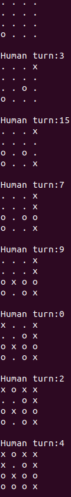

# TTT4

Rule
------
Game win condition: get 4 in a row in a 4 x 4 grid

To play
------
Edit 'first' in play.py to change first player\
Edit 'name' in play.py to change AI model\
run play.py\
enter in location to play\
location table:\
 0| 1| 2| 3\
 4| 5| 6| 7\
 8| 9|10|11\
12|13|14|15\

Requirement
------
tensorflow

Purpose
------
Create an AI using deep Q-learning that can master this game.

Training reward system
------
Moves that are invalid and loses the game are given -1 as reward. Moves that win the game are given 1 as reward. All other moves are given 0 as reward.
